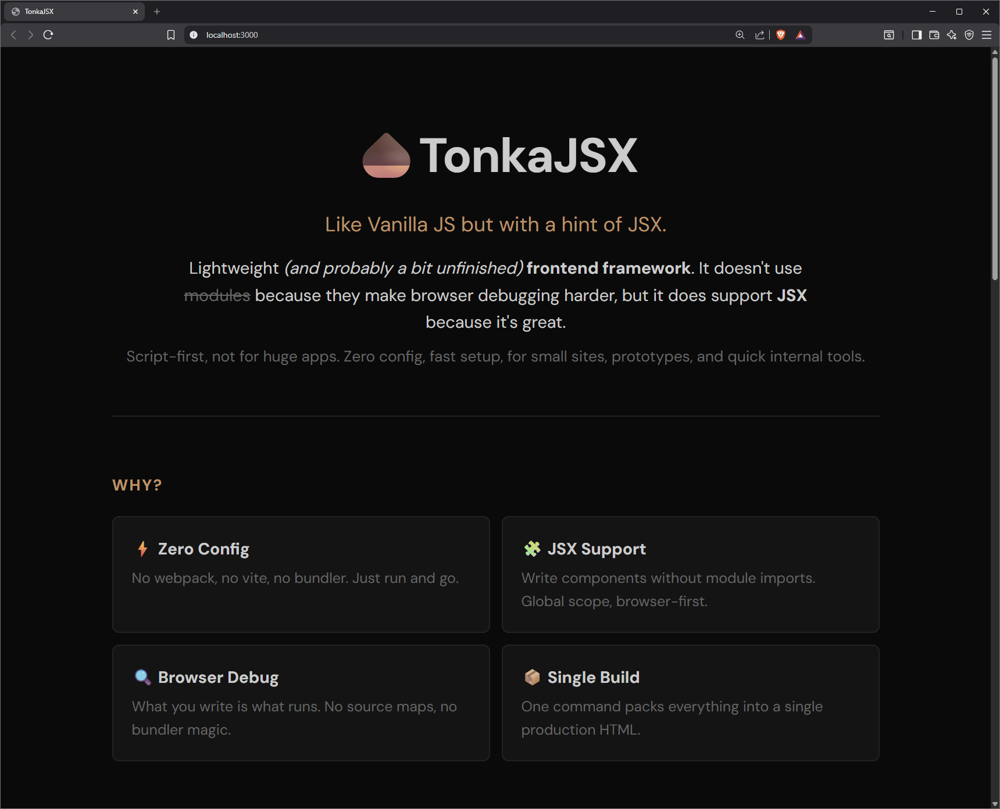

## 🌰TonkaJSX

Lightweight _(and probably a bit unfinished)_ **frontend framework**.
It doesn't use ~~**modules**~~ because they make browser debugging harder, but it does support **JSX** because it's great.
Script-first, not for huge apps. Zero config, fast setup, for small sites, prototypes, and quick internal tools.
The workspace contains the main scripts `serve.js` and `build.js`, plus the usual **Node.js** stuff.
Each website/app lives in its own project folder inside the workspace.
The structure is partly opinionated, but not too strict.

```
ROOT/                  (your workspace folder; name doesn't matter)
├─ tonka.js            (CLI entry: `tonka serve` / `tonka build`)
├─ build.js            (packs project into production `prod.html`)
├─ serve.js            (dev server; serves `index.html` if exists else `main.html` + injected links)
├─ utils.js            (shared helpers for `build.js` + `serve.js`)
├─ package.json        (npm config + `bin` for CLI)
├─ package-lock.json   (auto-generated by npm)
├─ readme.md           (this file)
├─ node_modules/       (npm trash; ignore in docs)
└─ <project-name>/     (one of many projects inside workspace)
   ├─ main.html        (required entry for dev)
   ├─ main.jsx         (optional main file referenced by `main.html`)
   ├─ <other>          (other optional referenced by `main.html` JS/JSX/CSS)
   ├─ index.html       (generated by `build.js`; often missing in dev)
   ├─ scripts/         (all JS/JSX source files)
   │  ├─ **/*.js
   │  └─ **/*.jsx
   ├─ styles/          (all CSS/SCSS styles)
   │  └─ **/*.css
   ├─ images/          (static assets, custom)
   ├─ fonts/           (static assets, custom)
   ├─ assets/          (static assets, custom)
   └─ <any-other>/     (videos, data, etc.)
```

After `install` and `link` that **tonka** command works globally.

```bash
npm install
npm link
```

The framework consists of two scripts: a development **server** and a **build** tool.

```bash
tonka serve [<project-name>] [--port|-p <port>]  # start the development server
tonka build [<project-name>] [--inline-remote|-i] # build the production version of the project
```

Server and build work on the chosen project. If you don't pass a project name, it picks the first one _(useful when you only have one)_.
If the project is built, `index.html` exists and the server serves it.
If not, the server uses `main.html` and injects styles from `styles/` and scripts from `scripts/`.
Script order matters: load `.js` first, then `.jsx`. Files in deeper folders load before files in parent folders.
All other files are served as static assets, exactly as they are in the project folder.
During build you can inline remote styles and scripts with `--inline-remote` (good for offline use).

## 💡 Example

No imports, no modules, just global components composed with **JSX**.

```jsx
const Greeting = ({ name }) => (
  <div class="greeting">
    <h1>Hello {name}!</h1>
    <p>This is a component.</p>
  </div>
);
const App = () => (
  <div>
    <Greeting name="World" />
    <Greeting name="TonkaJSX" />
  </div>
);
document.body.appendChild(<App />);
```

See the [**demo**](demo/) project included in this repo for a full working example.



## 🆚 Comparison

Subjective comparison with other technologies commonly used for similar small-site / tool use cases.

|Metric _(small sites & tools)_|TonkaJSX|Vanilla JS|Bootstrap|Tw+Alpine|Preact|Astro|
|:----|:---:|:---:|:---:|:---:|:---:|:---:|
|Fast start _(from zero to working)_|⭐⭐⭐|⭐⭐⭐|⭐⭐⭐|⭐|⭐⭐|⭐⭐|
|Low dependency _(low mental overhead)_|⭐⭐|⭐⭐⭐|⭐⭐|⭐⭐|⭐|⭐⭐|
|Custom look _(no template vibe)_|⭐⭐⭐|⭐⭐⭐|⭐|⭐⭐⭐|⭐⭐⭐|⭐⭐⭐|
|Ready-made components _(nav / modal etc.)_|⭐|⭐|⭐⭐⭐|⭐|⭐⭐|⭐⭐|
|Browser-level debugging _(no bundler magic)_|⭐⭐⭐|⭐⭐⭐|⭐⭐⭐|⭐⭐|⭐⭐|⭐|
|Code structure _(components / reuse)_|⭐⭐⭐|⭐|⭐|⭐⭐|⭐⭐⭐|⭐⭐⭐|
|Scaling & maintenance as project grows|⭐|⭐|⭐|⭐⭐|⭐⭐⭐|⭐⭐⭐|
|Handover & onboarding|⭐⭐|⭐|⭐⭐⭐|⭐⭐|⭐⭐|⭐⭐|
